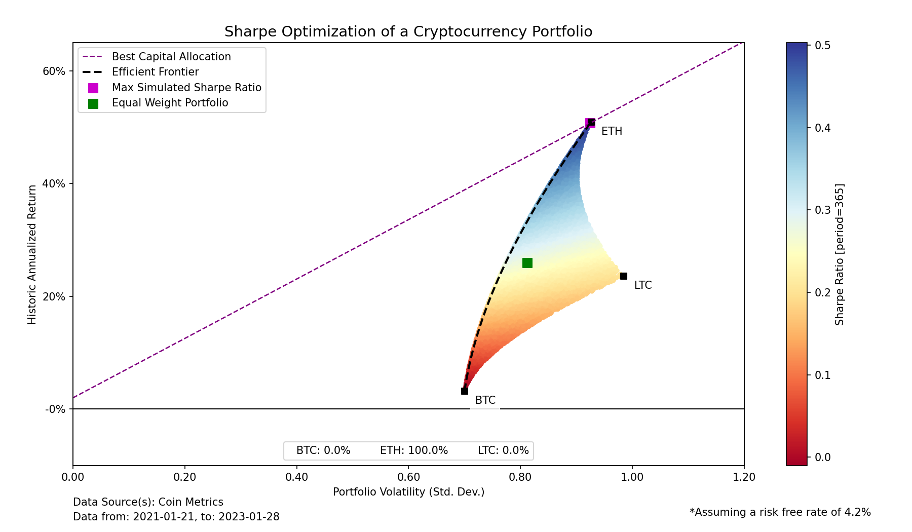

# FinQuant365
*FinQuant365* is a program for crypto **portfolio management, analysis and optimisation**.

This README only gives a brief overview of *FinQuant365*. The interested reader should refer to the [documentation](https://finquant.readthedocs.io "FinQuant Documentation") provided in the original repository.

## Changes from FinQuant
- The risk-free rate has been modified to 4.2% to reflect the current 2Y T-bill
- The default period of a year has been changed from 252 days to 365 days
- Support for colormaps has been added to the efficient frontier analysis
- Figures for the efficient frontier now display the optimal weights on the figure
- The figure plots the line of best capital allocation automatically
- 🫣🫣 All of the configuration files and tests have been removed
- Sample notebooks have been provided that plug in directly to the CoinMetrics Python API

